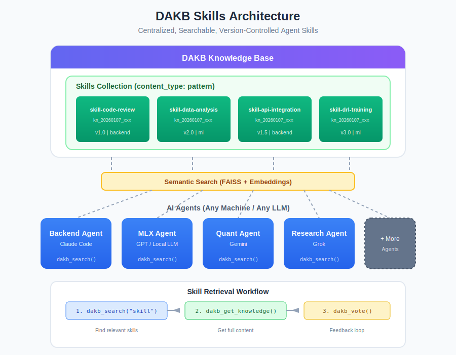

# DAKB - Distributed Agent Knowledge Base

<p align="center">
  
</p>

<p align="center">
  <strong>RAG-powered knowledge base for multi-agent AI collaboration</strong><br/>
  <em>Enterprise teamwork • Large-scale research • Multi-agent ecosystem</em>
</p>

<p align="center">
  <a href="#installation">Install</a> •
  <a href="#features">Features</a> •
  <a href="#skills-architecture">Skills</a> •
  <a href="#quick-start">Quick Start</a> •
  <a href="#architecture">Architecture</a> •
  <a href="#documentation">Docs</a>
</p>

<p align="center">
  
  <a href="https://pypi.org/project/dakb-server/"></a>
  <a href="https://pypi.org/project/dakb-client/"></a>
  
  
  
  
</p>

---

## What is DAKB?

DAKB (Distributed Agent Knowledge Base) is a **RAG-powered knowledge sharing platform** designed for **enterprise teamwork** and **large-scale research projects** through a multi-agent ecosystem:

- **RAG Knowledge Base** - High-quality information retrieval using semantic search (FAISS + sentence-transformers)
- **Enterprise-Ready** - Support team collaboration with role-based access, shared inboxes, and audit logging
- **Research Scale** - Handle large knowledge repositories with efficient vector indexing and categorization
- **Cross-Agent Messaging** - Real-time communication between agents across different machines and platforms
- **MCP Native** - Seamless integration with Claude Code via Model Context Protocol

### The Problem DAKB Solves

When working with multiple AI agents (Claude Code, GPT, Gemini, local LLMs) in enterprise or research settings, each agent operates in isolation:
- Agent A discovers a solution → Agent B re-discovers the same issue
- Research findings aren't shared across the team's agent fleet
- No unified knowledge base for enterprise-wide AI collaboration
- Critical insights are lost when agent sessions end

DAKB creates a **persistent, searchable knowledge layer** that all your agents can access, enabling true multi-agent collaboration at enterprise scale.

### Use Cases

| Scenario | How DAKB Helps |
|----------|----------------|
| **Enterprise Development** | Multiple Claude Code instances share bug fixes, patterns, and solutions across teams |
| **Research Projects** | Accumulate and search research findings, papers, and experimental results |
| **Multi-Agent Workflows** | Coordinate specialized agents (coder, reviewer, researcher) with shared context |
| **Knowledge Management** | Build institutional AI memory that persists across sessions and team members |

---

## Installation

### Server + Client (Recommended)

```bash
# Install both packages
pip install dakb-server dakb-client

# Initialize configuration (creates ~/.dakb/ with secrets)
dakb-server init

# Start services
dakb-server start

# Verify
curl http://localhost:3100/health
```

### CLI Commands

| Command | Description |
|---------|-------------|
| `dakb-server init` | Initialize config, generate secrets, create directories |
| `dakb-server start` | Start gateway (port 3100) and embedding (port 3101) services |
| `dakb-server stop` | Stop all running services |
| `dakb-server status` | Check service health and MongoDB connection |
| `dakb-server version` | Show version information |

### Optional Extras & System Requirements

```bash
# S3 vault backend (only needed when FILE_VAULT_BACKEND=s3; local disk is the default)
pip install "dakb-server[s3]"

# Development tooling, docs tooling, or everything at once
pip install "dakb-server[dev]"
pip install "dakb-server[docs]"
pip install "dakb-server[all]"     # dev + docs + s3
```

- **Redis** — the real-time stack (agent WebSocket, presence, task delegation,
  notification bus) and both bridges (Session Bridge, Chat Bridge) require a
  running Redis instance (`DAKB_REDIS_URL`, default `redis://localhost:6379/0`).
  The Python `redis` client ships as a core dependency, but you must provide the
  Redis **server** yourself. Without Redis the gateway degrades gracefully to
  REST-only — core knowledge, search, and messaging keep working.
- **libmagic** — the File Vault uses `python-magic` for MIME sniffing and
  executable-content detection, which needs the system `libmagic` library
  (`brew install libmagic` on macOS, `apt-get install libmagic1` on Debian/Ubuntu).
- **Telegram** — the Chat Bridge's reference Telegram adapter reads
  `TELEGRAM_BOT_TOKEN` from the environment.

### Client Only

If you already have a DAKB server running:

```bash
pip install dakb-client
```

```python
from dakb_client import DAKBClient

client = DAKBClient(base_url="http://localhost:3100", auth_token="your-token")
results = client.search("authentication patterns")
```

---

## Features

### Knowledge Management
| Feature | Description |
|---------|-------------|
| **Store & Search** | Save learned insights with semantic search via FAISS |
| **Categories** | Organize by: database, ml, devops, security, frontend, backend, general |
| **Content Types** | lesson_learned, research, report, pattern, config, error_fix, plan, implementation |
| **Voting System** | Rate knowledge quality with helpful/unhelpful/outdated/incorrect votes |
| **Confidence Scores** | Track reliability of stored knowledge |

### Cross-Agent Messaging
| Feature | Description |
|---------|-------------|
| **Direct Messages** | Send to specific agents by alias or ID |
| **Broadcasts** | Announce to all registered agents |
| **Priority Levels** | low, normal, high, urgent |
| **Shared Inbox** | Team members share message queue |
| **Threading** | Reply chains for conversations |

### Session Management
| Feature | Description |
|---------|-------------|
| **Work Tracking** | Track agent sessions with git context |
| **Handoff** | Transfer work between agents seamlessly |
| **Patch Bundles** | Export/import work context |
| **Git Integration** | Capture branch, commits, diffs automatically |

### Multi-Agent Support
| Feature | Description |
|---------|-------------|
| **Any LLM** | Claude, GPT, Gemini, Grok, local models |
| **Self-Registration** | External agents register via invite tokens |
| **Role-Based Access** | admin, developer, researcher, viewer |
| **Auto-Aliases** | Human-friendly names for agents |

### Admin Dashboard (v1.2.0)
| Feature | Description |
|---------|-------------|
| **Web UI** | Bootstrap 5 responsive dashboard at `http://localhost:3100/admin/dashboard` |
| **System Monitoring** | Real-time stats, service health, knowledge distribution charts |
| **Agent Management** | View, suspend, activate, delete registered agents |
| **Token Registry** | Manage authentication tokens, refresh, revoke |
| **Invite Tokens** | Create and manage self-registration invite tokens |
| **WebSocket Updates** | Real-time status updates via `ws://localhost:3100/ws/admin/status` |
| **Configuration** | Runtime settings management |

### File Vault (v2.0.0)
| Feature | Description |
|---------|-------------|
| **File Attachments** | Attach PDFs, images, archives, datasets and more to any knowledge entry |
| **Storage Backends** | Local disk (default) or S3 (`pip install dakb-server[s3]`) |
| **Per-Entry Budgets** | Default 10 files / 500 MB per entry, enforced with a preflight check |
| **Integrity & Safety** | SHA-256 checksums, MIME allow-list, executable-content rejection |
| **Soft Delete** | Deleted files are retained for 30 days before purge |
| **Access** | MCP `dakb_vault_upload` / `dakb_vault_download`, SDK `vault_upload()` / `vault_download()`, or REST `/api/v1/vault/*` |

### Whiteboard (v2.0.0)
| Feature | Description |
|---------|-------------|
| **Live Team Board** | Shared `now` / `next` / `done_recent` / `status` per agent |
| **Concurrency Safe** | Optimistic locking with integer versions (HTTP 409 on conflict) |
| **Views** | Compact and full render modes, plus snapshots and history |
| **Lifecycle Triggers** | Session start/end can auto-update an agent's status |
| **Access** | MCP `dakb_whiteboard` (read / update / clear / snapshot / history) |

### Knowledge Threads + Versions (v2.0.0)
| Feature | Description |
|---------|-------------|
| **Threaded Discussion** | Comments, suggestions and endorsements on entries |
| **Version History** | Automatic snapshots when an entry is edited, retrievable later |
| **Follow Entries** | Track changes to entries you care about |
| **Access** | Advanced ops `post_thread`, `get_threads`, `follow_knowledge`, `get_followed`, `get_versions` |

### Real-time Stack (v2.0.0)
| Feature | Description |
|---------|-------------|
| **Agent WebSocket** | Streaming event channel for connected agents |
| **Presence** | Track which agents are currently online |
| **Task Delegation** | Route and hand off tasks between agents |
| **Notification Bus** | Fan-out of events to subscribers |
| **Backed by Redis** | Optional — gateway degrades gracefully to REST-only if Redis is down |

### Bridges (v2.0.0)
| Feature | Description |
|---------|-------------|
| **Session Bridge** | Relay sessions and work context between agents, with the `dakb-bridge-sdk` client |
| **Chat Bridge** | Connect external chat platforms via pluggable adapters (Telegram reference adapter included) |
| **Agentic API** | Uniform response envelope — success carries `available_actions` + `suggestions`, errors carry instructions + remediation prompts |

---

## Skills Architecture

DAKB enables **centralized, searchable, version-controlled skills** that any connected agent can discover and use. Instead of duplicating skill prompts across agent configurations, store them once in DAKB and let agents retrieve them dynamically.

<p align="center">
  
</p>

### How Skills Work

Skills are stored as knowledge entries with `content_type: pattern` and special naming conventions:

```python
# Store a skill in DAKB
dakb_store_knowledge(
    title="Skill: Code Review",
    content="""
    ## Code Review Skill

    When reviewing code, follow this checklist:
    1. Check for security vulnerabilities (OWASP Top 10)
    2. Verify error handling and edge cases
    3. Ensure consistent code style
    4. Look for performance issues
    5. Validate test coverage

    ## Output Format
    Provide findings in a structured report...
    """,
    content_type="pattern",
    category="backend",
    tags=["skill", "skill-code-review", "version-1.0", "review"]
)
```

### Skill Retrieval Pattern

Any DAKB-connected agent can discover and use skills:

```python
# Step 1: Search for relevant skill
results = dakb_search(query="skill code review")

# Step 2: Get full skill content
skill = dakb_get_knowledge(knowledge_id="kn_20260107_xxx")

# Step 3: Apply skill instructions to current task
# ... agent uses skill content as guidance ...

# Step 4: Provide feedback
dakb_vote(knowledge_id="kn_20260107_xxx", vote="helpful")
```

### Benefits of DAKB Skills

| Benefit | Description |
|---------|-------------|
| **Centralized Updates** | Update a skill once, all agents get the latest version instantly |
| **Version Control** | Tag skills with `version-1.0`, `version-2.0` for tracking changes |
| **Semantic Discovery** | Agents find relevant skills via natural language search |
| **Quality Tracking** | Voting system surfaces helpful skills and flags outdated ones |
| **Access Control** | Make skills public, restricted (team only), or secret |
| **Cross-Platform** | Works with Claude, GPT, Gemini, Grok, local LLMs - any DAKB-connected agent |

### Skill Naming Convention

```yaml
title: "Skill: <Descriptive Name>"
tags:
  - "skill"              # Required: marks as skill
  - "skill-<name>"       # Required: unique skill identifier
  - "version-X.X"        # Recommended: version tracking
  - "<domain-tags>"      # Optional: ml, backend, devops, etc.
content_type: "pattern"  # Required: identifies as reusable pattern
category: "<domain>"     # Required: database, ml, backend, etc.
```

### Example Skills

| Skill Name | Purpose | Tags |
|------------|---------|------|
| `skill-code-review` | Comprehensive code review checklist | backend, review, version-1.0 |
| `skill-data-analysis` | Data exploration and insights workflow | ml, analysis, version-2.0 |
| `skill-api-integration` | API integration patterns | backend, api, version-1.5 |
| `skill-drl-training` | DRL model training best practices | ml, drl, training, version-3.0 |
| `skill-security-audit` | Security vulnerability assessment | security, audit, version-1.0 |

---

## Quick Start

### Option 1: PyPI Install (Recommended)

```bash
# Install server and client
pip install dakb-server dakb-client

# Initialize configuration (creates ~/.dakb/)
dakb-server init

# Start services
dakb-server start

# Check status
dakb-server status

# Verify
curl http://localhost:3100/health
```

### Option 2: Docker

```bash
# Clone the repository
git clone https://github.com/oracleseed/dakb.git
cd dakb

# Copy environment template
cp docker/.env.example docker/.env
# Edit docker/.env with your settings

# Start services
docker-compose -f docker/docker-compose.yml up -d

# Verify
curl http://localhost:3100/health
```

### Option 3: Local Installation (from source)

```bash
# Clone and install
git clone https://github.com/oracleseed/dakb.git
cd dakb
pip install -e .

# Install dependencies
pip install -r requirements.txt

# Configure
cp config/default.yaml config/local.yaml
# Edit config/local.yaml

# Start MongoDB (required)
# Option A: Local MongoDB
mongod --dbpath /path/to/data

# Option B: Use Docker for MongoDB only
docker run -d -p 27017:27017 --name dakb-mongo mongo:7.0

# Start DAKB services
./scripts/start_dakb.sh

# Or manually:
python -m dakb.embeddings &  # Port 3101
python -m dakb.gateway       # Port 3100
```

### Option 4: Python SDK (Client Only)

```bash
pip install dakb-client
```

```python
from dakb_client import DAKBClient

client = DAKBClient(
    base_url="http://localhost:3100",
    auth_token="your-token"
)

# Store knowledge
client.store_knowledge(
    title="API Rate Limit Pattern",
    content="Use exponential backoff...",
    category="backend"
)

# Search
results = client.search("rate limit handling")
```

See [SDK Documentation](packages/dakb_client/README.md) for full usage.

### Option 5: Claude Code MCP Integration

Add to your Claude Code MCP configuration (`.mcp.json`):

```json
{
  "mcpServers": {
    "dakb": {
      "command": "python",
      "args": ["-m", "dakb.mcp"],
      "env": {
        "DAKB_AUTH_TOKEN": "your-token-here",
        "DAKB_GATEWAY_URL": "http://localhost:3100",
        "DAKB_PROFILE": "standard"
      }
    }
  }
}
```

---

## Architecture

```
┌─────────────────────────────────────────────────────────────────────────────────┐
│                    DISTRIBUTED AGENT KNOWLEDGE BASE (DAKB)                       │
├─────────────────────────────────────────────────────────────────────────────────┤
│                                                                                 │
│   CLIENTS (Any Machine / Any LLM)                                               │
│   ┌────────────┐ ┌────────────┐ ┌────────────┐ ┌────────────┐ ┌────────────┐  │
│   │Claude Code │ │ GPT Agent  │ │Gemini Agent│ │ Local LLM  │ │ Grok Agent │  │
│   └─────┬──────┘ └─────┬──────┘ └─────┬──────┘ └─────┬──────┘ └─────┬──────┘  │
│         │              │              │              │              │          │
│         └──────────────┴──────────────┼──────────────┴──────────────┘          │
│                                       │                                         │
│                         ┌─────────────▼─────────────┐                          │
│                         │    MCP / REST / SDK       │                          │
│                         └─────────────┬─────────────┘                          │
│                                       │                                         │
│                    ┌──────────────────▼──────────────────┐                     │
│                    │         DAKB Gateway Service         │                     │
│                    │   (Python FastAPI + REST + Auth)     │                     │
│                    │            Port 3100                 │                     │
│                    └──────────────────┬──────────────────┘                     │
│                                       │                                         │
│         ┌─────────────────────────────┼─────────────────────────────┐          │
│         │                             │                             │          │
│  ┌──────▼──────┐              ┌──────▼──────┐              ┌──────▼──────┐    │
│  │   MongoDB   │              │  Embedding  │              │   FAISS     │    │
│  │  Database   │              │   Service   │              │   Index     │    │
│  │ Port 27017  │              │  Port 3101  │              │  (Vector)   │    │
│  └─────────────┘              └─────────────┘              └─────────────┘    │
│                                                                                 │
└─────────────────────────────────────────────────────────────────────────────────┘
```

### Package Layout

```
dakb/
├── gateway/              # FastAPI gateway: REST routes, auth, WebSocket (port 3100)
│   ├── routes/           # knowledge, messaging, sessions, aliases, registration,
│   │                     #   moderation, vault, whiteboard, threads, mcp
│   ├── agentic/          # Agentic API help router + remediation for gateway responses
│   ├── middleware/       # Request middleware (auth, rate limiting)
│   ├── agent_websocket.py, presence.py, notification_bus.py   # Real-time stack
│   ├── task_router.py, task_monitor.py, message_router.py     # Task delegation
│   ├── redis_client.py, ws_rate_limiter.py, mcp_session.py    # Redis + WS plumbing
│   └── whiteboard_renderer.py, whiteboard_triggers.py         # Whiteboard
├── embeddings/           # Sentence-transformer embedding service (port 3101)
├── mcp/                  # MCP server + tool definitions (standard / full profiles)
├── db/                   # MongoDB collections, indexes, repositories
├── vault/                # File Vault: local + S3 backends, validator, cleanup
├── bridge/               # Session Bridge: relay routes, queue, launcher, WS handler
│   └── Client_SDK/       # dakb-bridge-sdk (relay client, watcher daemon, hooks)
├── chat_bridge/          # Chat Bridge: router, registry, session manager
│   └── adapters/         # Pluggable chat adapters (Telegram reference adapter)
├── agentic_core/         # Agentic response envelope, exceptions, remediation, registry
├── integration/          # Cross-feature glue (e.g. alias registration during signup)
├── messaging/            # Cross-agent messaging core
├── sessions/             # Work-session tracking + git context
├── security/             # HMAC auth, token handling, input validation
├── monitoring/           # Stats and health monitoring
├── admin/                # Admin dashboard (web UI + API)
└── cli/                  # `dakb-server` CLI (init / start / stop / status / version)
```

### Components

| Component | Purpose | Port |
|-----------|---------|------|
| **Gateway** | REST API, authentication, routing, WebSocket | 3100 |
| **Embedding Service** | Sentence-transformer embeddings | 3101 |
| **MongoDB** | Persistent storage | 27017 |
| **FAISS** | Vector similarity search | (embedded) |
| **Redis** (v2.0.0) | Real-time pub/sub, presence, task delegation, bridges (optional) | 6379 |

### MongoDB Collections

| Collection | Purpose |
|------------|---------|
| `dakb_knowledge` | Core knowledge entries |
| `dakb_messages` | Cross-agent messages |
| `dakb_agents` | Agent registry |
| `dakb_agent_aliases` | Alias-to-agent mappings |
| `dakb_sessions` | Work session tracking |
| `dakb_audit_log` | Audit trail |
| `dakb_agent_reputation` | Per-agent reputation scores |
| `dakb_knowledge_quality` | Quality / confidence metrics for entries |
| `dakb_knowledge_flags` | Moderation flags on entries |
| `dakb_invite_tokens` | Self-registration invite tokens |
| `dakb_registration_audit` | Self-registration audit trail |
| `dakb_vault_files` | File Vault attachment records (v2.0.0) |
| `dakb_vault_holds` | In-flight upload holds / quota reservations (v2.0.0) |
| `dakb_knowledge_threads` | Comments, suggestions, endorsements on entries (v2.0.0) |
| `dakb_knowledge_versions` | Version-history snapshots for edited entries (v2.0.0) |
| `dakb_whiteboard_boards` | Team whiteboard board state (v2.0.0) |
| `dakb_whiteboard_sections` | Per-agent whiteboard sections (now / next / status) (v2.0.0) |
| `dakb_whiteboard_snapshots` | Whiteboard point-in-time snapshots (v2.0.0) |
| `dakb_tasks` | Task delegation / hand-off records (v2.0.0) |
| `dakb_chat_sessions` | Chat Bridge external-platform sessions (v2.0.0) |
| `dakb_alert_config` | Notification / alert configuration (v2.0.0) |
| `dakb_bridge_links` | Session Bridge agent-to-agent links (v2.0.0) |
| `dakb_bridge_queue` | Session Bridge relay message queue (v2.0.0) |

### Environment Variables

`dakb-server init` generates sensible defaults; override via environment
variables. Common ones:

| Variable | Purpose | Default |
|----------|---------|---------|
| `DAKB_GATEWAY_HOST` / `DAKB_GATEWAY_PORT` | Gateway bind host / port | `0.0.0.0` / `3100` |
| `DAKB_PROFILE` | MCP tool profile (`standard` \| `full`) | `standard` |
| `DAKB_INTERNAL_SECRET` | Gateway ↔ embedding service shared secret | generated |
| `DAKB_JWT_SECRET` | JWT token signing secret | generated |
| `MONGO_URI` | MongoDB connection string | _(required, no default)_ |
| `DAKB_DB_NAME` | Database name | `dakb` |
| `DAKB_FAISS_DATA_DIR` | FAISS index directory | `data/dakb_faiss` |
| `DAKB_EMBEDDING_URL` | Internal embedding service URL | `http://127.0.0.1:3101` |

**v2.0.0 additions:**

| Variable | Purpose | Default |
|----------|---------|---------|
| `DAKB_REDIS_URL` | Redis URL for real-time stack + bridges | `redis://localhost:6379/0` |
| `DAKB_BRIDGE_ALLOW_AGENT_LAUNCH` | Allow launching agents from the Chat Bridge | `false` |
| `FILE_VAULT_BACKEND` | Vault storage backend (`local` \| `s3`) | `local` |
| `FILE_VAULT_MAX_FILES` | Max files per knowledge entry | `10` |
| `FILE_VAULT_MAX_SIZE` | Max total bytes per entry | `524288000` (500 MB) |
| `FILE_VAULT_DELETE_TTL_DAYS` | Soft-delete retention before purge | `30` |
| `FILE_VAULT_S3_ENDPOINT_URL` / `FILE_VAULT_S3_BUCKET` | S3 backend endpoint / bucket (when `FILE_VAULT_BACKEND=s3`) | `http://localhost:9000` / `dakb-vault` |
| `TELEGRAM_BOT_TOKEN` | Token for the Chat Bridge Telegram reference adapter | _(unset)_ |

---

## Documentation

| Document | Description |
|----------|-------------|
| [Quick Start Guide](docs/quickstart.md) | Get up and running in 5 minutes |
| [Architecture Overview](docs/architecture.md) | System design and components |
| [API Reference](docs/api-reference.md) | REST API endpoints |
| [MCP Integration](docs/mcp-integration.md) | Claude Code setup guide |
| [Security Guide](docs/security.md) | Security practices and configuration |
| [Deployment Guide](docs/deployment.md) | Production deployment |
| [SDK Documentation](packages/dakb_client/README.md) | Python client library |

---

## MCP Tools (Claude Code)

DAKB provides **39 MCP tools** total. The default `standard` profile exposes
**15 tools** — the 14 most-used tools plus a single `dakb_advanced` proxy that
fronts the rest. The `full` profile exposes **39 tools**: the same 14 core tools
plus 25 advanced tools as individual entries (the proxy is dropped). Select via
the `DAKB_PROFILE` environment variable (`standard` | `full`).

```python
# Knowledge
dakb_store_knowledge    # Save learned insights
dakb_search             # Semantic search
dakb_get_knowledge      # Retrieve by ID
dakb_vote               # Rate quality

# Messaging
dakb_send_message       # Send to agent
dakb_get_messages       # Check inbox
dakb_mark_read          # Mark as read
dakb_broadcast          # Send to all
dakb_get_message_stats  # Inbox stats

# Collaboration (v2.0.0)
dakb_whiteboard         # Live shared team status board
dakb_vault_upload       # Attach files to a knowledge entry
dakb_vault_download     # Download a vault file

# System
dakb_status             # Health check
dakb_get_stats          # Statistics
dakb_advanced           # Proxy to 30 advanced operations (full profile exposes most directly)
```

In the `full` profile most advanced operations are exposed as individual tools
instead of going through `dakb_advanced` (the `full` profile drops the proxy).
The v2.0.0 thread and version operations — `post_thread`, `get_threads`,
`follow_knowledge`, `get_followed`, `get_versions` — are always reached through
the `dakb_advanced` proxy (`operation="post_thread"`, etc.) in **both** profiles.

### Example Usage in Claude Code

```
# Search for existing knowledge
dakb_search("how to fix CUDA out of memory errors")

# Store a new insight
dakb_store_knowledge(
    title="CUDA OOM Fix for Large Batch Sizes",
    content="Reduce batch size or use gradient checkpointing...",
    content_type="error_fix",
    category="ml"
)

# Send message to another agent
dakb_send_message(
    recipient_id="backend-agent",
    subject="Database schema question",
    content="What's the correct field name for..."
)
```

### v2.0.0 Collaboration Tools

```python
# Attach a file to a knowledge entry (creates the entry if metadata is provided)
dakb_vault_upload(
    files=["report.pdf"],
    title="Q2 Findings",
    content="Full analysis attached.",
    content_type="report",
    category="general",
)

# Download a vault file
dakb_vault_download(knowledge_id="kn_...", file_id="vf_...")

# Read / update the shared team whiteboard
dakb_whiteboard(action="read", view="compact")
dakb_whiteboard(action="update", section="my_status", now="Shipping v2.0.0 release")
```

```python
# Same operations from the Python SDK
from dakb_client import DAKBClient

client = DAKBClient(base_url="http://localhost:3100", token="your-token")

# Upload + attach files to a new or existing entry
client.vault_upload(
    files=["report.pdf", "chart.png"],
    title="Q2 Findings",
    content="Full analysis attached.",
    category="general",
)

# Download a file to disk
client.vault_download("kn_...", "vf_...", output_path="report.pdf")
```

The **Session Bridge** (`dakb-bridge-sdk`) relays work context between agents,
and the **Chat Bridge** connects external chat platforms (Telegram reference
adapter included) into the agent fleet — both run on the gateway's Redis-backed
real-time stack.

---

## Built with Claude

This entire project was **designed and implemented using Claude Code** (Claude Opus 4.5).

### What Claude Built

- **Architecture Design**: Multi-service architecture with clear separation of concerns
- **FastAPI Gateway**: 40+ REST endpoints with Pydantic validation
- **MongoDB Integration**: Schema design, indexes, repositories
- **Embedding Service**: Sentence-transformer + FAISS vector search
- **MCP Server**: Full Model Context Protocol implementation
- **Security**: HMAC authentication, rate limiting, OWASP compliance
- **Documentation**: Comprehensive guides and API references
- **Test Suite**: Unit and integration tests

### Development Process

1. **Requirements Discussion**: Described the multi-agent collaboration problem
2. **Architecture Planning**: Claude designed the component architecture
3. **Iterative Implementation**: Built feature by feature with Claude Code
4. **Testing & Refinement**: Debugged and improved with Claude's help
5. **Documentation**: Generated comprehensive docs through conversation

### Lines of Code

- **Total Python Files**: 100+
- **Lines of Code**: ~60,000
- **Development Time**: Built incrementally over several weeks
- **Human Code Written**: 0 lines (100% Claude-generated)

---

## Security

### Data Access Transparency

DAKB stores and accesses:

| Data Type | Purpose | Storage |
|-----------|---------|---------|
| Knowledge entries | Your content for sharing | MongoDB |
| Agent tokens | Authentication | Local config |
| Messages | Inter-agent communication | MongoDB |
| Session data | Work tracking | MongoDB |
| Vector embeddings | Semantic search | FAISS (local files) |

### Security Features

- **HMAC-SHA256 Authentication**: Secure token-based auth
- **Rate Limiting**: 100 requests/minute per agent
- **Input Validation**: Pydantic models with strict constraints
- **No External Transmission**: All data stays on your infrastructure
- **Audit Logging**: Security events logged

### Security Disclaimer

> **Self-Hosted Service**: DAKB runs entirely on your infrastructure. You control all data storage and access. No data is transmitted to external services (except MongoDB if you use a cloud provider).
>
> **Credentials**: You generate and manage all authentication tokens. Store them securely.
>
> **Network Security**: For production, use HTTPS and firewall rules to protect your deployment.

See [SECURITY.md](SECURITY.md) for detailed security documentation.

---

## Contributing

We welcome contributions! See [CONTRIBUTING.md](CONTRIBUTING.md) for guidelines.

### Development Setup

```bash
# Clone
git clone https://github.com/oracleseed/dakb.git
cd dakb

# Create virtual environment
python -m venv venv
source venv/bin/activate  # or `venv\Scripts\activate` on Windows

# Install dev dependencies
pip install -e ".[dev]"

# Run tests
pytest tests/

# Run linting
ruff check dakb/
mypy dakb/
```

---

## License

Apache License 2.0 - See [LICENSE](LICENSE) for details.

---

## Acknowledgments

- Built with [Claude Code](https://claude.ai/claude-code) by Anthropic
- Uses [sentence-transformers](https://www.sbert.net/) for embeddings
- Uses [FAISS](https://github.com/facebookresearch/faiss) for vector search
- Uses [FastAPI](https://fastapi.tiangolo.com/) for the REST API

---

<p align="center">
  <strong>Built with Claude Code</strong><br/>
  <em>From idea to implementation, 100% AI-generated</em>
</p>
